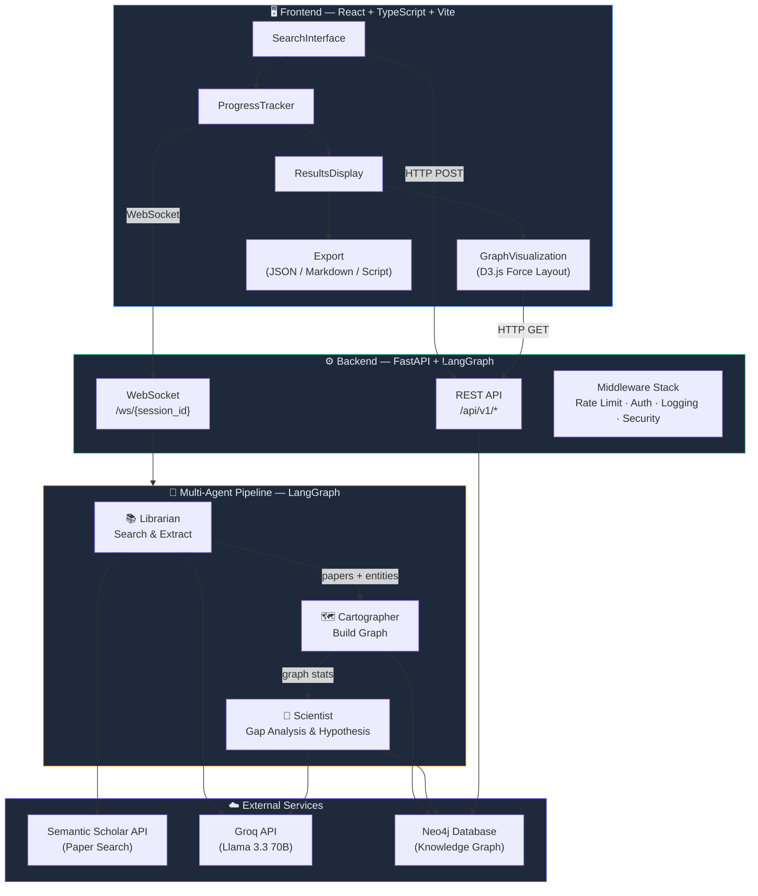
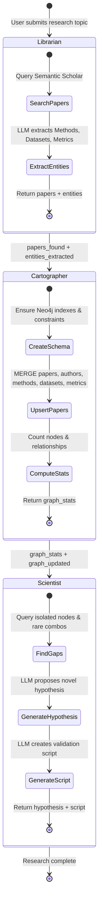
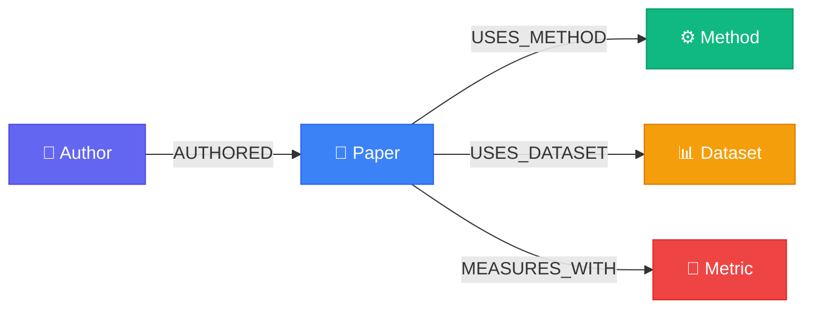
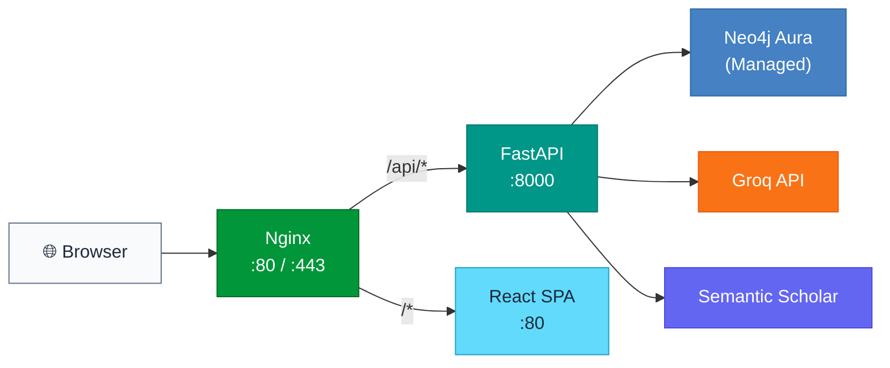

<div align="center">

# 🔬 Scientific Pathfinder

### AI-Powered Research Gap Discovery Using Knowledge Graphs & Multi-Agent LLMs

[](https://github.com/Pruthviraj-333/scientific-pathfinder/actions/workflows/ci.yml)
[](https://www.python.org/)
[](https://react.dev/)
[](https://fastapi.tiangolo.com/)
[](https://neo4j.com/)
[](https://www.docker.com/)
[](https://langchain-ai.github.io/langgraph/)
[](https://www.typescriptlang.org/)

<br/>

> **Autonomous multi-agent system** that searches scientific literature, builds a knowledge graph in Neo4j, discovers structural holes in research, and proposes novel testable hypotheses — all in real-time via WebSockets.

<br/>

[Features](#-key-features) · [Demo](#-demo) · [Architecture](#-system-architecture) · [Quick Start](#-quick-start) · [API](#-api-reference) · [Deployment](#-deployment)

</div>

---

## 📽️ Demo

[](https://www.youtube.com/watch?v=mLGEBYz4YEE)

> *Click the image above to watch the complete research session demo on YouTube: entering a topic, watching the three agents work in real-time via WebSocket, and exploring the generated knowledge graph and hypothesis.*

---

## ✨ Key Features

| Feature | Description |
| :--- | :--- |
| 🤖 **Multi-Agent Orchestration** | Three specialized AI agents (Librarian → Cartographer → Scientist) orchestrated via **LangGraph** state machine |
| 📚 **Automated Literature Search** | Queries the **Semantic Scholar API** to fetch relevant papers with abstracts, citations, and metadata |
| 🧠 **LLM-Powered Entity Extraction** | Uses **Llama 3.3 70B** (via Groq) to extract Methods, Datasets, and Metrics from paper abstracts |
| 🗺️ **Knowledge Graph Construction** | Automatically builds a structured **Neo4j** graph with Papers, Authors, Methods, Datasets, and Metrics |
| 🔍 **Structural Gap Analysis** | Runs Cypher queries to find isolated nodes, rare method-dataset combinations, and disconnected research communities |
| 💡 **Hypothesis Generation** | Proposes novel, testable research hypotheses based on discovered gaps |
| 🐍 **Validation Script Generation** | Generates executable Python scripts to validate the proposed hypothesis |
| 📊 **Interactive Graph Visualization** | Renders the knowledge graph using **D3.js** force-directed layout with zoom, pan, and node inspection |
| ⚡ **Real-Time Progress** | Live updates via **WebSocket** connection as each agent completes its task |
| 📤 **Multi-Format Export** | Export results as JSON, Markdown report, or downloadable Python script |
| 🔒 **Production-Ready Backend** | Rate limiting, API key auth, security headers, structured logging, health checks, and metrics |
| 🐳 **Fully Dockerized** | One-command deployment with `docker compose up` — includes Neo4j, Backend, and Frontend |

---

## 🏗️ System Architecture

### High-Level Overview



### Agent Workflow (LangGraph State Machine)



### Knowledge Graph Schema (Neo4j)



**Node Properties:**

| Node | Key Properties |
| :--- | :--- |
| `Paper` | `paper_id` (unique), `title`, `abstract`, `year`, `citation_count`, `url` |
| `Author` | `name` (unique) |
| `Method` | `name` (unique) — e.g., *BERT*, *Vision Transformer*, *Random Forest* |
| `Dataset` | `name` (unique) — e.g., *ImageNet*, *COCO*, *GLUE* |
| `Metric` | `name` (unique) — e.g., *Accuracy*, *F1-Score*, *BLEU* |

---

## 🛠️ Tech Stack

| Layer | Technology | Why This Choice |
| :--- | :--- | :--- |
| **Frontend** | React 18, TypeScript, Vite, TailwindCSS, D3.js | Type-safe UI with fast HMR; D3 for interactive force-directed graph visualization |
| **Backend** | Python 3.11, FastAPI, Pydantic v2 | Async-first framework with automatic OpenAPI docs and data validation |
| **Agent Orchestration** | LangGraph (LangChain) | Stateful, graph-based agent workflow with built-in state management |
| **LLM** | Groq API — Llama 3.3 70B Versatile | Ultra-fast inference (~200 tokens/sec) for entity extraction and hypothesis generation |
| **Knowledge Graph** | Neo4j 5 Community | Native graph database for relationship-first queries and gap analysis |
| **Real-Time Communication** | WebSockets (native FastAPI) | Bidirectional live progress updates as each agent completes its task |
| **Data Source** | Semantic Scholar API | Free academic paper search with abstracts, citations, and metadata |
| **Containerization** | Docker & Docker Compose | Single-command deployment of all 3 services (Backend + Frontend + Neo4j) |
| **Reverse Proxy** | Nginx | Production SSL termination, static file serving, and load balancing |
| **CI/CD** | GitHub Actions | Automated testing, linting, and deployment pipelines |

---

## 🚀 Quick Start

### Prerequisites

- [Docker](https://docs.docker.com/get-docker/) & Docker Compose installed
- A free [Groq API key](https://console.groq.com/keys)

### 1. Clone & Configure

```bash
git clone https://github.com/Pruthviraj-333/scientific-pathfinder.git
cd scientific-pathfinder
```

Create a `.env` file in the project root:

```env
GROQ_API_KEY=gsk_your_groq_api_key_here

# Optional — for higher Semantic Scholar rate limits:
# SEMANTIC_SCHOLAR_API_KEY=your_key_here
```

### 2. Launch (One Command)

```bash
docker compose up -d --build
```

### 3. Use the App

| Service | URL |
| :--- | :--- |
| 🌐 **Frontend** | [http://localhost:3000](http://localhost:3000) |
| ⚙️ **Backend API** | [http://localhost:8000/docs](http://localhost:8000/docs) |
| 🗄️ **Neo4j Browser** | [http://localhost:7474](http://localhost:7474) — `neo4j` / `devpassword123` |

### 4. Stop

```bash
docker compose down       # Stop services
docker compose down -v    # Stop + remove database volumes
```

<details>
<summary><strong>🔧 Manual Setup (Without Docker)</strong></summary>

#### Backend

```bash
cd scientific_pathfinder
python -m venv venv
source venv/bin/activate      # Windows: venv\Scripts\activate
pip install -r requirements.txt
cp .env.example .env          # Edit with your API keys
python -m uvicorn api:app --reload
```

#### Frontend

```bash
cd scientific_pathfinder_frontend
npm install
cp .env.example .env          # Edit VITE_API_URL if needed
npm run dev
```

> **Note:** You'll also need a running Neo4j instance. You can start one with:
> ```bash
> docker run -d -p 7474:7474 -p 7687:7687 -e NEO4J_AUTH=neo4j/devpassword123 neo4j:5-community
> ```

</details>

---

## 🔌 API Reference

### REST Endpoints

| Method | Endpoint | Description |
| :--- | :--- | :--- |
| `POST` | `/api/v1/research/start` | Start a new research analysis session |
| `GET` | `/api/v1/research/{session_id}` | Get session status and results |
| `GET` | `/api/v1/graph/{session_id}` | Get graph data for D3.js visualization |
| `POST` | `/api/v1/graph/clear` | Clear the Neo4j database |
| `GET` | `/api/v1/health` | Full health check (Neo4j + Groq + Semantic Scholar) |
| `GET` | `/api/v1/health/live` | Kubernetes liveness probe |
| `GET` | `/api/v1/health/ready` | Kubernetes readiness probe |
| `GET` | `/api/v1/metrics` | API metrics (request counts, latency, errors) |

### WebSocket

| Protocol | Endpoint | Description |
| :--- | :--- | :--- |
| `WS` | `/ws/{session_id}` | Real-time agent progress updates |

**WebSocket Message Types:**

```json
{"type": "progress", "step": "librarian", "message": "Searching papers..."}
{"type": "status",   "agent": "librarian", "message": "Found 8 papers"}
{"type": "complete", "data": {"hypothesis": "...", "papers": 8, "gaps": 3}}
{"type": "error",    "message": "Rate limit exceeded"}
```

---

## 📁 Project Structure

```
scientific-pathfinder/
├── docker-compose.yml                  # Development (Backend + Frontend + Neo4j)
├── docker-compose.prod.yml             # Production (+ Nginx reverse proxy)
├── nginx/nginx.conf                    # Reverse proxy config
├── .github/workflows/
│   ├── ci.yml                          # CI — lint, test, build
│   └── deploy.yml                      # CD — deploy pipeline
│
├── scientific_pathfinder/              # ── Backend (Python / FastAPI) ──
│   ├── api.py                          # FastAPI app, routes, WebSocket handler
│   ├── config.py                       # Pydantic settings with validation
│   ├── Dockerfile                      # Multi-stage production build
│   ├── requirements.txt
│   ├── src/
│   │   ├── agents.py                   # 🤖 Librarian, Cartographer, Scientist agents
│   │   ├── state.py                    # LangGraph state definition (TypedDict)
│   │   ├── graph_db.py                 # Neo4j CRUD, schema, gap-analysis queries
│   │   ├── tools.py                    # Semantic Scholar API client with retry logic
│   │   ├── database.py                 # DB connection lifecycle manager
│   │   ├── schemas.py                  # Pydantic request/response models
│   │   ├── middleware.py               # Rate limiting, API key auth, security headers
│   │   ├── exceptions.py               # Custom exception hierarchy
│   │   ├── logging_config.py           # Structured logging (text/JSON)
│   │   └── metrics.py                  # Request/error/latency metrics
│   ├── prompts/
│   │   └── system_prompts.py           # Optimized LLM prompts for each agent
│   └── tests/
│       ├── conftest.py                 # Pytest fixtures
│       ├── test_api.py                 # API endpoint tests
│       ├── test_config.py              # Configuration tests
│       └── test_schemas.py             # Schema validation tests
│
└── scientific_pathfinder_frontend/     # ── Frontend (React / TypeScript / Vite) ──
    ├── Dockerfile                      # Multi-stage build (build → nginx)
    ├── nginx.conf                      # Frontend serving config
    ├── src/
    │   ├── App.tsx                      # Root component with session state
    │   ├── config/index.ts             # Environment config (API URLs)
    │   ├── services/api.ts             # Centralized HTTP/WS client
    │   ├── components/
    │   │   ├── SearchInterface.tsx      # Topic input + paper limit slider
    │   │   ├── ProgressTracker.tsx      # Real-time agent progress via WebSocket
    │   │   ├── ResultsDisplay.tsx       # Hypothesis, stats, export actions
    │   │   ├── GraphVisualization.tsx   # D3.js force-directed graph renderer
    │   │   ├── PapersList.tsx           # Analyzed papers list
    │   │   ├── PaperDetailsModal.tsx    # Individual paper detail view
    │   │   ├── ErrorBoundary.tsx        # React error boundary
    │   │   └── LoadingStates.tsx        # Skeleton loading components
    │   ├── types/index.ts              # TypeScript interfaces
    │   └── utils/export.ts             # JSON/Markdown/Script export utilities
    └── vite.config.ts
```

---

## ⚙️ Environment Variables

### Backend

| Variable | Required | Default | Description |
| :--- | :---: | :--- | :--- |
| `GROQ_API_KEY` | ✅ | — | Groq API key for LLM inference |
| `NEO4J_URI` | ✅ | — | Neo4j connection URI |
| `NEO4J_PASSWORD` | ✅ | — | Neo4j password |
| `NEO4J_USERNAME` | ❌ | `neo4j` | Neo4j username |
| `ENVIRONMENT` | ❌ | `development` | `development` / `production` |
| `CORS_ORIGINS` | ❌ | `localhost:3000,5173` | Comma-separated allowed origins |
| `SEMANTIC_SCHOLAR_API_KEY` | ❌ | — | Higher Semantic Scholar rate limits |
| `API_KEY` | ❌ | — | Enable API key authentication |
| `RATE_LIMIT_REQUESTS` | ❌ | `60` | Max requests per minute per client |
| `LOG_FORMAT` | ❌ | `text` | `text` (dev) / `json` (prod) |

### Frontend

| Variable | Required | Default | Description |
| :--- | :---: | :--- | :--- |
| `VITE_API_URL` | ❌ | `http://localhost:8000` | Backend API base URL |

> **Note:** When using `docker compose` for development, only `GROQ_API_KEY` is required in the root `.env`. Neo4j is automatically configured with default credentials.

---

## 🧪 Testing

```bash
cd scientific_pathfinder
pip install -r requirements.txt
pytest tests/ -v --tb=short
```

Tests cover:
- API endpoint contracts and error handling
- Configuration validation (Pydantic settings)
- Request/response schema integrity
- Middleware behavior (rate limiting, auth)

---

## 🚢 Deployment

See [**DEPLOYMENT.md**](DEPLOYMENT.md) for detailed guides:

| Platform | Method |
| :--- | :--- |
| 🐳 **Local Docker** | `docker compose up -d` |
| 🏭 **Production VPS** | `docker compose -f docker-compose.prod.yml up -d --build` |
| ☁️ **Render** | Separate Web Service (backend) + Static Site (frontend) |
| 🚂 **Railway** | Auto-detect Docker monorepo |

### Production Architecture



---

## 🤝 Contributing

Contributions are welcome! Please follow these steps:

1. Fork the repository
2. Create a feature branch: `git checkout -b feature/amazing-feature`
3. Commit your changes: `git commit -m 'Add amazing feature'`
4. Push to the branch: `git push origin feature/amazing-feature`
5. Open a Pull Request

---

## 📄 License

This project is licensed under the **MIT License** — see the [LICENSE](LICENSE) file for details.

---

<div align="center">

**Built with ❤️ for researchers exploring the frontiers of science**

[⬆ Back to Top](#-scientific-pathfinder)

</div>
